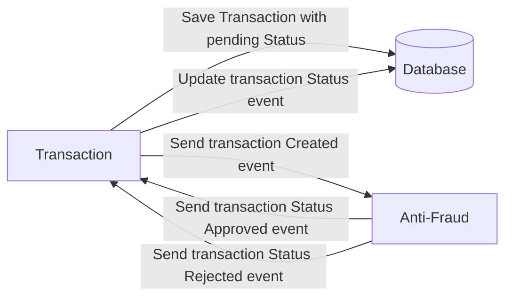

# Yape Code Challenge :rocket:

Our code challenge will let you marvel us with your Jedi coding skills :smile:. 

Don't forget that the proper way to submit your work is to fork the repo and create a PR :wink: ... have fun !!

- [Problem](#problem)
- [Tech Stack](#tech_stack)
- [Send us your challenge](#send_us_your_challenge)

# Problem

Every time a financial transaction is created it must be validated by our anti-fraud microservice and then the same service sends a message back to update the transaction status.
For now, we have only three transaction statuses:

<ol>
  <li>pending</li>
  <li>approved</li>
  <li>rejected</li>  
</ol>

Every transaction with a value greater than 1000 should be rejected.



# Tech Stack

<ol>
  <li>Node. You can use any framework you want (i.e. Nestjs with an ORM like TypeOrm or Prisma) </li>
  <li>Any database</li>
  <li>Kafka</li>    
</ol>

We do provide a `Dockerfile` to help you get started with a dev environment.

You must have two resources:

1. Resource to create a transaction that must containt:

```json
{
  "accountExternalIdDebit": "Guid",
  "accountExternalIdCredit": "Guid",
  "tranferTypeId": 1,
  "value": 120
}
```

2. Resource to retrieve a transaction

```json
{
  "transactionExternalId": "Guid",
  "transactionType": {
    "name": ""
  },
  "transactionStatus": {
    "name": ""
  },
  "value": 120,
  "createdAt": "Date"
}
```

## Optional

You can use any approach to store transaction data but you should consider that we may deal with high volume scenarios where we have a huge amount of writes and reads for the same data at the same time. How would you tackle this requirement?

You can use Graphql;

# Send us your challenge

When you finish your challenge, after forking a repository, you **must** open a pull request to our repository. There are no limitations to the implementation, you can follow the programming paradigm, modularization, and style that you feel is the most appropriate solution.

If you have any questions, please let us know.

# Challenge Solution

### Requirements

- NodeJS => 20.12.2
- PostgreSQL => 14.11
- Kafka => confluentinc/cp-kafka:6.1.1 (docker image (specified in docker-compose file))

### Used Tech stack

#### Tech stack

- Typescript
- NestJS
- TypeORM
- Kafka
- GraphQL (Code-First)

#### Testing tech stack

- Grafana K6
- Postman
- GraphQL Playground

### Description

We have two microservices for solve the code challenge 

- Transactions microservice
- Anti-Fraud microservice

Both microservices are communicated by kafka based on Event Pattern using NestJS Framework. Every microservice is independently and have a unique responsability.

The microservices are placed in the same pull request.

### Transactions microservice

This microservice have the responsability to make the transactions actions like create, find and update.

We can find the project in `transactions` folder. To Navigate to it we can navigate via `cd` command and run it with `yarn` or `npm`.

```bash
$ cd transactions

$ yarn 
$ npm install

$ yarn build
$ npm run build

$ yarn run start:prod
$ npm run start:prod
```

#### Database Initialization Script

Before you run the project you need to initializate the database tables with the next sql script.

```sql
-- Table: public.transactions

-- DROP TABLE IF EXISTS public.transactions;

CREATE TABLE IF NOT EXISTS public.transactions
(
    guid uuid NOT NULL DEFAULT uuid_generate_v4(),
    "accountExternalIdDebit" uuid NOT NULL,
    "accountExternalIdCredit" uuid,
    "tranferTypeId" smallint NOT NULL,
    value numeric NOT NULL,
    status smallint DEFAULT 1, -- default PENDING status
    "createdAt" timestamp with time zone DEFAULT now(),
    "updatedAt" timestamp with time zone DEFAULT now(),
    CONSTRAINT transactions_pkey PRIMARY KEY (guid)
)

TABLESPACE pg_default;

ALTER TABLE IF EXISTS public.transactions
    OWNER to postgres;

COMMENT ON COLUMN public.transactions.status
    IS '1 = Pending
2 = Approved
3 = Rejected';
```

### Anti-Fraud microservice

This microservice have the responsability to validate some transactions characteristics, in this case i only validate the value field based on challenge requirements, but we can validate other fields for accomplish other goals.

We can find this project in `anti-fraud` folder. To Navigate to it we can navigate via `cd` command and run it with `yarn` or `npm`.

```bash
$ cd anti-fraud

$ yarn 
$ npm install

$ yarn build
$ npm run build

$ yarn run start:prod
$ npm run start:prod
```

**Note:** the microservice starts normally but based on the process flow we need to have `Transactions Microservice` initialized  

